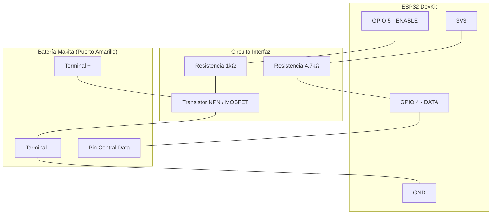

# Esquema Eléctrico - Makita OBI ESP32

Este documento describe las conexiones necesarias para construir el hardware de diagnóstico.

## Diagrama de Conexiones

## Listado de Conexiones (Pinout)

| Origen (ESP32) | Destino | Notas |
| :--- | :--- | :--- |
| **GND** | Terminal **-** Batería | Masa común obligatoria. |
| **GPIO 4** | **DATA (OneWire)** | Comunicación bidireccional con el BMS de la batería. |
| **GPIO 4** | Resistencia **4.7kΩ** a **3.3V** | Pull-up externo (Recomendado para estabilidad). |
| **GPIO 5** | Base Transistor (Vía R 1kΩ) | Pin de habilitación (ENABLE). |

## Componentes Necesarios (BOM)

1. **Microcontrolador**: ESP32 DevKit V1 (30 o 38 pines).
2. **Resistencias**:
    - 1x 4.7kΩ (Pull-up datos).
    - 1x 1kΩ (Base transistor).
3. **Semiconductor**:
    - 1x Transistor NPN (BC547 o similar) o MOSFET canal N (2N7000) para el circuito de habilitación.
4. **Conector**: Adaptador impreso en 3D o terminales de pala para encajar en el puerto de la batería Makita.
5. **Cableado**: Cables macho-hembra o placa de prototipos (Breadboard/Stripboard).

> [!IMPORTANT]
> Asegúrate de que la masa (GND) del ESP32 esté unida al terminal negativo de la batería, de lo contrario la comunicación OneWire no funcionará.
